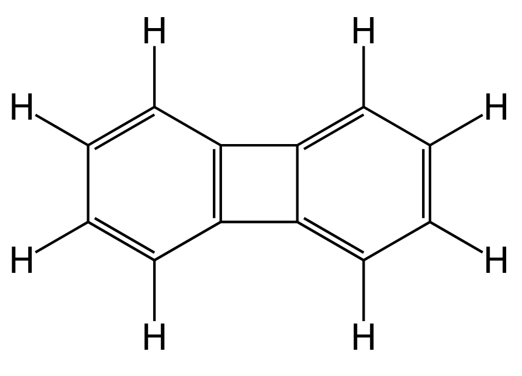

# react-2d-molecule

`@vibbioinfocore/react-2d-molecule` is a React component to display molecule structures in a 2D SVG.

## Installation

Typescript type definitions are included.

* NPM

```bash
npm install @vibbioinfocore/react-2d-molecule
```

* Yarn

```bash
yarn add @vibbioinfocore/react-2d-molecule
```

## Usage

```jsx
import React from 'react';
import { Molecule } from '@vibbioinfocore/react-2d-molecule';

// Biphenylene
const mol = {
  "width": 9.294,
  "height": 6.0,
  "atoms": [
    { "x": -3.348, "y": -0.75, "element": "C" },
    { "x": -2.049, "y": -1.5, "element": "C" },
    { "x": -0.75, "y": -0.75, "element": "C" },
    { "x": -0.75, "y": 0.75, "element": "C" },
    { "x": -2.049, "y": 1.5, "element": "C" },
    { "x": -3.348, "y": 0.75, "element": "C" },
    { "x": 0.75, "y": 0.75, "element": "C" },
    { "x": 2.049, "y": 1.5, "element": "C" },
    { "x": 3.348, "y": 0.75, "element": "C" },
    { "x": 3.348, "y": -0.75, "element": "C" },
    { "x": 2.049, "y": -1.5, "element": "C" },
    { "x": 0.75, "y": -0.75, "element": "C" },
    { "x": -4.647, "y": -1.5, "element": "H" },
    { "x": -2.049, "y": -3.0, "element": "H" },
    { "x": -2.049, "y": 3.0, "element": "H" },
    { "x": -4.647, "y": 1.5, "element": "H" },
    { "x": 2.049, "y": 3.0, "element": "H" },
    { "x": 4.647, "y": 1.5, "element": "H" },
    { "x": 4.647, "y": -1.5, "element": "H" },
    { "x": 2.049, "y": -3.0, "element": "H" }
  ],
  "bonds": [
    { "atoms": [[3, 6, "UNIMPL" ]] },
    { "atoms": [[11, 2, "SINGLE"]] },
    { "atoms": [[0, 12, "SINGLE"]] },
    { "atoms": [[1, 13, "SINGLE"]] },
    { "atoms": [[4, 14, "SINGLE"]] },
    { "atoms": [[5, 15, "SINGLE"]] },
    { "atoms": [[7, 16, "SINGLE"]] },
    { "atoms": [[8, 17, "SINGLE"]] },
    { "atoms": [[9, 18, "SINGLE"]] },
    { "atoms": [[10, 19, "SINGLE"]] },
    { "atoms": [[0, 1, "SINGLE"],
                [1, 2, "DOUBLE"],
                [2, 3, "SINGLE"],
                [3, 4, "DOUBLE"],
                [4, 5, "SINGLE"],
                [5, 0, "DOUBLE"]], "key": "RING" },
    { "atoms": [[6, 7, "SINGLE"],
                [7, 8, "DOUBLE"],
                [8, 9, "SINGLE"],
                [9, 10, "DOUBLE"],
                [10, 11, "SINGLE"],
                [11, 6, "DOUBLE"]], "key": "RING" }
  ]
};

export const ViewAMolecule = () => <Molecule molecule={mol} />;
```

This is rendered as:



## Component Attributes

### Required

* `molecule: MoleculeData` A description of the molecule to display.

### Optional

* `translateX: number` Translate the whole image on the X axis (default: `0`).
* `translateY: number` Translate the whole image on the Y axis (default: `0`).
* `scale: number` Scale the whole image by some fraction (default: `1`).
* `width: number` The width of the drawing area in pixels (default: `100`).
* `height: number` The height of the drawing area in pixels (default: `100`).
* `labelTranslateX: number` Translate each atom label, in the x direction, by this number of pixels (default: `0`).
* `labelTranslateY: number` Translate each atom label, in the y direction, by this number of pixels (default: `0`).
* `atomClicked: (index: number) => void` A callback function accepting the index of the clicked atom.
* `atomLabel: (atom: Atom, index: number) => string` A callback function defining the text to display in the label for the given atom.
* `atomStyle: (element: string, index: number): React.CSSProperties` A hook specifying CSS styles for the SVG `<circle>`.
* `atomLabelStyle: (element: string, index: number): React.CSSProperties` A hook specifying CSS styles for the SVG `<text>`.

## Contributing

Pull requests are welcome. For major changes, please open an issue first
to discuss what you would like to change.

Please make sure to update tests as appropriate.

## License

[MIT](https://choosealicense.com/licenses/mit/)
